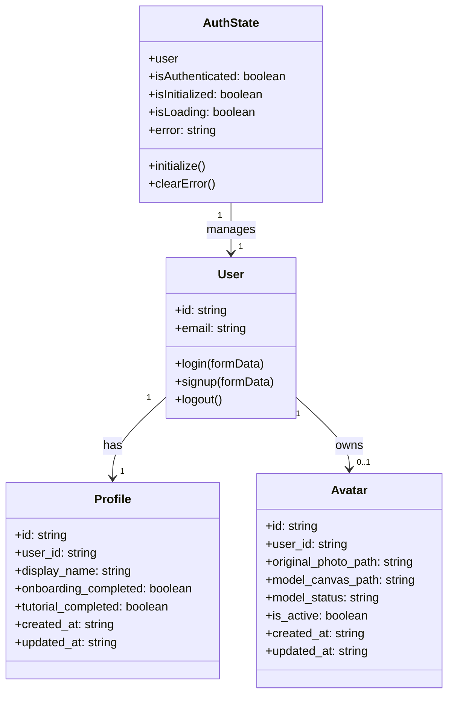

# Diagram 1: User Management

```mermaid
classDiagram
    class User {
        +id: string
        +email: string
        +login(formData)
        +signup(formData)
        +logout()
    }

    class Profile {
        +id: string
        +user_id: string
        +display_name: string
        +onboarding_completed: boolean
        +tutorial_completed: boolean
        +created_at: string
        +updated_at: string
    }

    class Avatar {
        +id: string
        +user_id: string
        +original_photo_path: string
        +model_canvas_path: string
        +model_status: string
        +is_active: boolean
        +created_at: string
        +updated_at: string
    }

    class AuthState {
        +user
        +isAuthenticated: boolean
        +isInitialized: boolean
        +isLoading: boolean
        +error: string
        +initialize()
        +clearError()
    }

    %% Relationships
    User "1" --> "1" Profile : has
    User "1" --> "0..1" Avatar : owns
    AuthState "1" --> "1" User : manages
```
