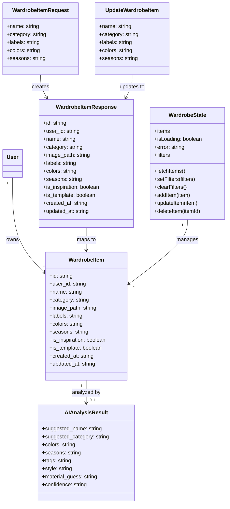

# Diagram 2: Wardrobe Domain

```mermaid
classDiagram
    class WardrobeItem {
        +id: string
        +user_id: string
        +name: string
        +category: string
        +image_path: string
        +labels: string
        +colors: string
        +seasons: string
        +is_inspiration: boolean
        +is_template: boolean
        +created_at: string
        +updated_at: string
    }

    class WardrobeItemRequest {
        +name: string
        +category: string
        +labels: string
        +colors: string
        +seasons: string
    }

    class WardrobeItemResponse {
        +id: string
        +user_id: string
        +name: string
        +category: string
        +image_path: string
        +labels: string
        +colors: string
        +seasons: string
        +is_inspiration: boolean
        +is_template: boolean
        +created_at: string
        +updated_at: string
    }

    class UpdateWardrobeItem {
        +name: string
        +category: string
        +labels: string
        +colors: string
        +seasons: string
    }

    class AIAnalysisResult {
        +suggested_name: string
        +suggested_category: string
        +colors: string
        +seasons: string
        +tags: string
        +style: string
        +material_guess: string
        +confidence: string
    }

    class WardrobeState {
        +items
        +isLoading: boolean
        +error: string
        +filters
        +fetchItems()
        +setFilters(filters)
        +clearFilters()
        +addItem(item)
        +updateItem(item)
        +deleteItem(itemId)
    }

    %% Relationships
    User "1" --> "*" WardrobeItem : owns
    
    WardrobeItemRequest --> WardrobeItemResponse : creates
    WardrobeItemResponse --> WardrobeItem : maps to
    UpdateWardrobeItem --> WardrobeItemResponse : updates to
    
    WardrobeItem "1" --> "0..1" AIAnalysisResult : analyzed by
    
    WardrobeState "1" --> "*" WardrobeItem : manages
```
