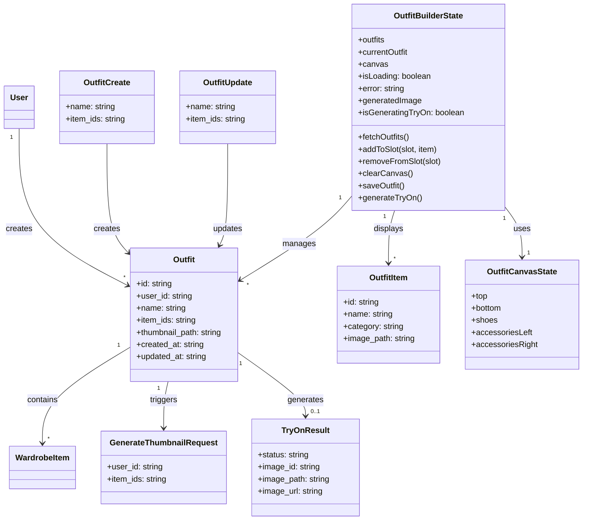

# Diagram 3: Outfit Domain

```mermaid
classDiagram
    class Outfit {
        +id: string
        +user_id: string
        +name: string
        +item_ids: string
        +thumbnail_path: string
        +created_at: string
        +updated_at: string
    }

    class OutfitItem {
        +id: string
        +name: string
        +category: string
        +image_path: string
    }

    class OutfitCreate {
        +name: string
        +item_ids: string
    }

    class OutfitUpdate {
        +name: string
        +item_ids: string
    }

    class GenerateThumbnailRequest {
        +user_id: string
        +item_ids: string
    }

    class TryOnResult {
        +status: string
        +image_id: string
        +image_path: string
        +image_url: string
    }

    class OutfitCanvasState {
        +top
        +bottom
        +shoes
        +accessoriesLeft
        +accessoriesRight
    }

    class OutfitBuilderState {
        +outfits
        +currentOutfit
        +canvas
        +isLoading: boolean
        +error: string
        +generatedImage
        +isGeneratingTryOn: boolean
        +fetchOutfits()
        +addToSlot(slot, item)
        +removeFromSlot(slot)
        +clearCanvas()
        +saveOutfit()
        +generateTryOn()
    }

    %% Relationships
    User "1" --> "*" Outfit : creates
    
    Outfit "1" --> "*" WardrobeItem : contains
    
    OutfitCreate --> Outfit : creates
    OutfitUpdate --> Outfit : updates
    Outfit "1" --> GenerateThumbnailRequest : triggers
    
    Outfit "1" --> "0..1" TryOnResult : generates
    
    OutfitBuilderState "1" --> "*" Outfit : manages
    OutfitBuilderState "1" --> "1" OutfitCanvasState : uses
    OutfitBuilderState "1" --> "*" OutfitItem : displays
```
