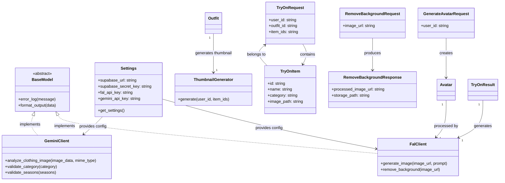

# Diagram 4: AI Services

```mermaid
classDiagram
    %% Abstract Base Class
    class BaseModel {
        <<abstract>>
        +error_log(message)
        +format_output(data)
    }

    class Settings {
        +supabase_url: string
        +supabase_secret_key: string
        +fal_api_key: string
        +gemini_api_key: string
        +get_settings()
    }

    class FalClient {
        +generate_image(image_url, prompt)
        +remove_background(image_url)
    }

    class GeminiClient {
        +analyze_clothing_image(image_data, mime_type)
        +validate_category(category)
        +validate_seasons(seasons)
    }

    class ThumbnailGenerator {
        +generate(user_id, item_ids)
    }

    class GenerateAvatarRequest {
        +user_id: string
    }

    class TryOnRequest {
        +user_id: string
        +outfit_id: string
        +item_ids: string
    }

    class TryOnItem {
        +id: string
        +name: string
        +category: string
        +image_path: string
    }

    class RemoveBackgroundRequest {
        +image_url: string
    }

    class RemoveBackgroundResponse {
        +processed_image_url: string
        +storage_path: string
    }

    %% Implementation Relationships
    BaseModel <|.. FalClient : implements
    BaseModel <|.. GeminiClient : implements
    
    Settings --> FalClient : provides config
    Settings --> GeminiClient : provides config

    %% Service Relationships
    Avatar "1" --> "1" FalClient : processed by
    Outfit "1" --> "1" ThumbnailGenerator : generates thumbnail
    TryOnResult "1" --> "1" FalClient : generates
    
    GenerateAvatarRequest --> Avatar : creates
    TryOnRequest --> TryOnItem : contains
    TryOnItem --> TryOnRequest : belongs to
    RemoveBackgroundRequest --> RemoveBackgroundResponse : produces
```
