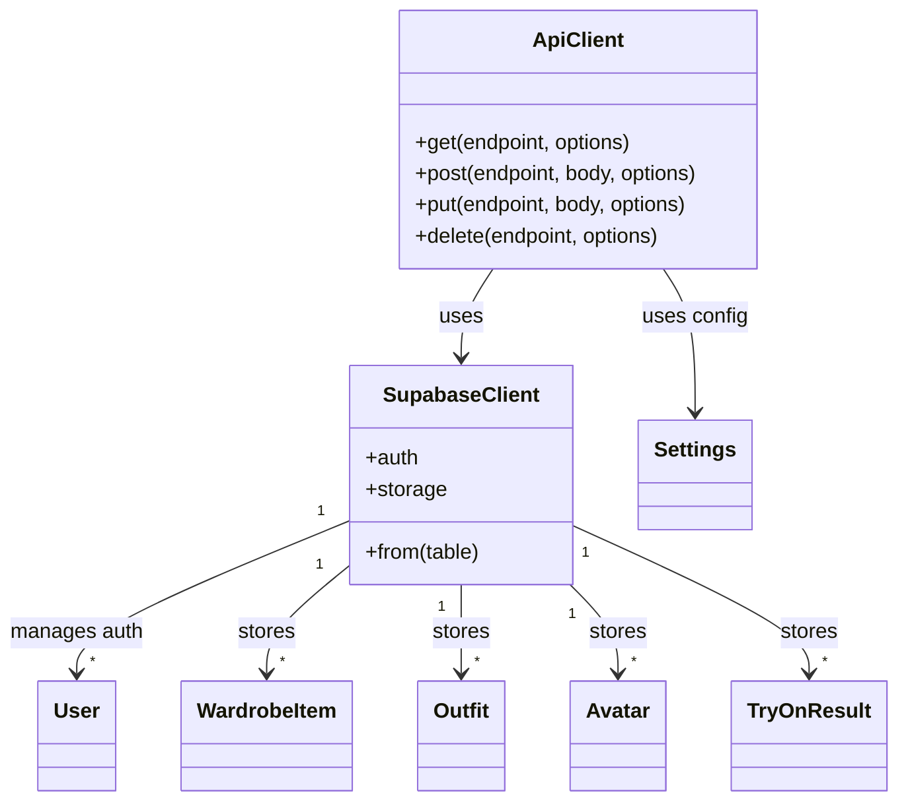

# Diagram 5: API Infrastructure

```mermaid
classDiagram
    class ApiClient {
        +get(endpoint, options)
        +post(endpoint, body, options)
        +put(endpoint, body, options)
        +delete(endpoint, options)
    }

    class SupabaseClient {
        +auth
        +from(table)
        +storage
    }

    %% Relationships
    ApiClient --> SupabaseClient : uses
    ApiClient --> Settings : uses config
    
    SupabaseClient "1" --> "*" User : manages auth
    SupabaseClient "1" --> "*" WardrobeItem : stores
    SupabaseClient "1" --> "*" Outfit : stores
    SupabaseClient "1" --> "*" Avatar : stores
    SupabaseClient "1" --> "*" TryOnResult : stores
```
